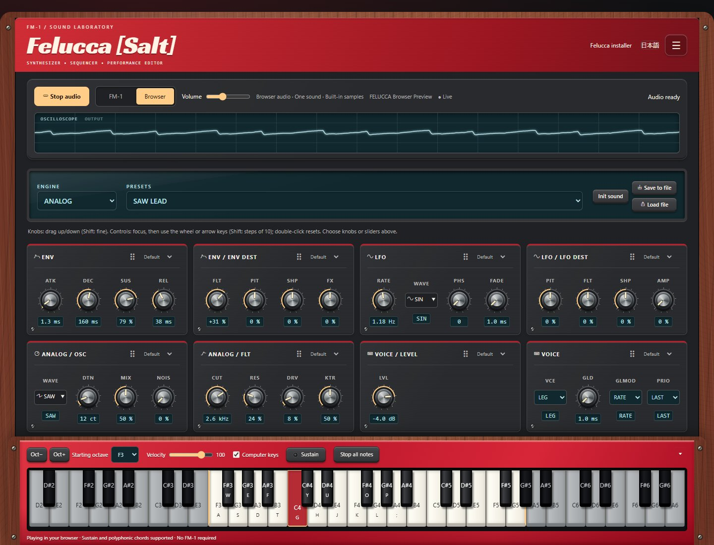
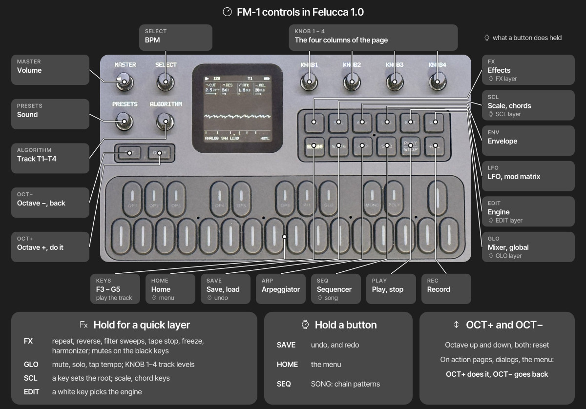

# Felucca [Salt]

Felucca [Salt] by Chance Roth (@ChanceTheMaker), based on Felucca by Leo Kuroshita
and Hügelton Instruments. Current Salt release: **0.9-salt14**.

**[Open Studio](https://chancethemaker.github.io/Felucca/webapp/editor/)** ·
**[Install Felucca [Salt] Beta](https://chancethemaker.github.io/Felucca/webapp/installer/)**

A multi-engine synthesizer for the M-VAVE FM-1 and a hardware-inspired browser
Studio. Select **Browser** in the Studio to start playing without an FM-1 or a
firmware installation. Select **FM-1** to edit your connected instrument.

Current device firmware is **0.9-salt14 beta**. Website updates do not require
reflashing the device. Experimental Bluetooth builds are not included in this release.

Salt14 includes keremimo's TRS MIDI receive-buffer fix: note-off messages are
processed from the bytes actually received, avoiding stuck notes caused by a
hardware byte-count mismatch. Install the new firmware to receive this fix.

### Upstream 1.0 and the next Salt release

[Felucca 1.0](https://github.com/hugelton/Felucca/tree/v1.0) is being integrated
into Salt in separate feature PRs. **The published installer still provides
0.9-salt14**; the additions below are not a description of the currently shipped
Salt firmware or browser synth.

Upstream 1.0 brings thirteen engines, including six-operator **FM6**, **PHYS**,
**NOISE**, **SLICE**, and **DRUM**. Each of the four tracks can use a synth engine;
MIDI channels 1–4 address tracks 1–4. It also adds pattern chaining (SONG),
per-step chance, motion recording, chord keys, a four-slot modulation matrix,
performance quick layers, and USB stereo audio recording. Its web tools add
FM6 patch editing, sample recording and trimming, full backup/restore, and a
return-to-official-V15 workflow.

The 1.0 integration preserves Salt's TRS receive-buffer fix and restores its
display and MIDI monitor options. Firmware candidates still need hardware
validation before replacing the published release. The browser engine and
editor require their own updates; a website update alone does not upgrade a
connected FM-1.

### FM-1 controls: 1.0 preview

The [illustrated control guide](https://chancethemaker.github.io/Felucca/webapp/installer/#fm1-guide)
groups the controls by function and highlights them on a vector drawing. Its
explanations are available in all eight website languages. It documents
**Felucca 1.0**; some shortcuts are not available in Salt14.

| Control | Felucca 1.0 behavior |
| --- | --- |
| MASTER / SELECT | Master volume / tempo (BPM) |
| PRESETS / ALGORITHM | Sound / track T1–T4 |
| KNOB 1–4 | Edit the four columns of the current page |
| FX / SCL / ENV / LFO / EDIT / GLO | Effects, scale and chords, envelope, modulation, engine, mixer/global pages |
| HOME / SAVE / ARP / SEQ | Home, save/load, arpeggiator, sequencer |
| PLAY / REC | Start/stop all tracks / arm the selected track on any page |
| Hold FX / GLO / SCL / EDIT | Performance, mixer, scale/chord, and engine quick layers |
| Hold SAVE / HOME / SEQ | Undo/redo, menu, and SONG pattern chaining |
| OCT− / OCT+ | Octave down/up; press both to reset. In dialogs and menus: back/confirm |

The 27 touch keys span F3–G5 before octave shifting. See the
[upstream controls reference](https://github.com/hugelton/Felucca/tree/v1.0#controls)
for the full 1.0 workflow. The released Salt14 feature descriptions follow below.

## Install on an FM-1

Connect the FM-1 directly to your computer with a USB data cable, open the
[installer](https://chancethemaker.github.io/Felucca/webapp/installer/) in Chrome
or Edge, and select **Install Felucca [Salt] Beta**. Close other MIDI apps and
do not unplug the cable while writing. Normal installation needs no extra hardware.

Although tested on device, this firmware is a beta. The author accepts no
responsibility if your FM-1 is damaged or misbehaves because of this custom
firmware. Use it at your own risk. A failed installation can leave the device
unable to boot; recovery may require an
[FM-1 Transporter](https://github.com/kurogedelic/FM-1-transporter).
Returning to official firmware requires M-VAVE's M-UPGRADE updater and official
FM-1 firmware from [M-VAVE downloads](https://www.m-vave.com/download).

## Studio highlights

- **FM-1 / Browser switch:** Browser starts audio on selection; FM-1 mode provides
  the connected device editor. Switching back stops browser audio.
- **Browser synth:** nine engines, 54 factory presets, built-in samples, expressive
  controls, chords, sustain, and independent browser volume.
- **Live oscilloscope:** a full-width waveform of the browser's actual audio output.
- **Twelve themes:** Stage Red, Matrix, Vintage DX, Model D, Chocolate, Vaporwave,
  and more, with light/dark modes and a dedicated high-contrast theme.
- **Hardware styling:** wood accents where appropriate, molded surfaces, screws,
  speaker grilles, and locally hosted display fonts.
- **Custom layout:** choose knobs or sliders for each Sound card, drag cards into
  your preferred order, and select full width from the upper-right menu.
- **Docked keyboard:** mouse, touch, and computer-key playing; octave controls,
  sustain, and a collapsible tray. Starts with the FM-1's 27-key F3–G5 range and
  adds shaded keys outside that range when space permits.

Browser mode currently plays **one sound**. Sequencing, track mixing, sample
uploads, and projects are not connected to browser playback yet. Use **Save to
file** to keep sound edits. The full device workflow remains available in FM-1
mode. See [browser engine details and build instructions](web/audio/README.md).

## Salt firmware additions

- TRS MIDI input alongside USB, with sustain, pitch bend, mod wheel, and MIDI reset handling.
- Internal, USB, or TRS clock and MIDI Start/Stop/Continue, including keremimo's contribution.
- Twenty screen palettes, including eight light palettes and light/dark high contrast.
- Regular/bold text, track colors, and clearer playback, recording, and MIDI status colors.
- Persistent preset favorites with All/Favorites browsing and no repeated entries in short lists.
- MIDI event or note/chord monitor, including pedal-sustained notes.
- Compatible Studio controls for device display settings, clock source, and favorite presets.

## Core firmware features

- **Nine engines** (below), each with its own factory presets
- **Four tracks:** three synth parts, each with its own engine and sound, plus a GM drum track;
  8 voices shared between the parts. ALGORITHM selects the track on every page
- **Sequencer:** 64 steps per track with chords, ties, accent and slide; live loop recording
  with overdub and held notes; each track loops on its own length
- **Arpeggiator**, scales and quantize, glide, MONO / LEGATO / UNISON voice modes
- **Effects:** distortion and the SLICER per track; chorus, delay and reverb sends; master limiter
- **Presets:** factory presets with their own patterns, 32 user preset slots, 4 project slots
- **Web editor:** every parameter of every track, step grid, track mixer, preset library, sample upload
- **USB:** class-compliant MIDI in and out (channels 1–3 for the parts, 10 for drums);
  updates over the same USB cable
- **TRS MIDI input:** shares USB's track routing and supports pitch bend, mod-wheel vibrato, sustain and MIDI panic; [controls and limits](docs/MIDI-EXPRESSION.txt)
- **MIDI status:** GLO > SYSTEM knob 1 switches the first column between USB status and TRS status/activity; both inputs remain active

## Engines

- **ANALOG**: virtual analog; two oscillators (saw, square, triangle, sine, PWM), noise, drive, resonant low-pass filter
- **DIGITAL**: 4-operator FM, 8 algorithms, feedback
- **PHASE**: phase distortion (ported from CrispyZebra)
- **LOFI**: chiptune; pulse, triangle, saw, noise and a 4-bit wave RAM, stepped envelope, sweep, arpeggio
- **SAMPLE**: multisampled instruments and 3 user sample slots
- **VOICE**: formant oscillator, sung vowels
- **TRIO**: 3 oscillators with ring modulation and sync, multimode filter (LP / BP / HP / notch)
- **WHEEL**: tonewheel-style organ; drawbar registrations, percussion, key click, drive, rotary speaker
- **GRAIN**: granular textures from the built-in samples or a user slot

**SLICER** (FX page, every track including drums): a tempo-synced 16-step gate or stutter, with 16 patterns.

- Install: [web installer](https://chancethemaker.github.io/Felucca/) (Chrome or Edge, USB), or `tools/fm1_install.py` from a terminal
- Editor: [web editor](https://chancethemaker.github.io/Felucca/webapp/editor/)
- Build: [BUILDING.md](BUILDING.md)

## Screen colors

Hold HOME and choose COLOR. Turn knob 1 or press OCT+ to preview a theme;
leave the menu to save it. The original five palettes are joined by VIOLET,
PINK, ICE, WARM, two-color OCEAN (cyan/amber) and DUSK (violet/gold), HI-CON,
and light-background LIGHT, PAPER, SKY, MINT, LILAC, ROSE, and SAND themes.
L-HICON adds a white background with black values, dark labels and inactive
controls, and stronger separators for high contrast in light mode.

The FONT row directly below COLOR selects REGULAR or BOLD Terminus. Turn
knob 1 left/right or press OCT+ to switch, with an immediate preview; exit
the menu to save. Both weights use the same character spacing. Existing
settings migrate with REGULAR selected and retain panel calibration.

LOWCUT reduces deep bass in the final stereo output (two high-pass stages,
approximately 110 Hz each, 12 dB/octave combined roll-off), intended for the
small built-in speaker. Leave it OFF to retain full bass in the output.

MIDI MON below FONT selects OFF, EVENTS, or NOTES. A single line appears at
the lower-right inside the HOME waveform area. EVENTS shows incoming USB/TRS
messages; clock is summarized without hiding each note/controller immediately.
NOTES shows the selected track's held or pedal-sustained notes, including
onboard keys, MIDI, sequencer, and arp playback. Up to four pitches are shown,
with +N for additional pitches. Notes stay visible until released; MIDI sustain
keeps released keys visible until pedal-up. The mode defaults to OFF and saves
when leaving the menu.

Track numbers and the selected track's footer use blue, orange, violet, and
green for tracks 1 through 4. Play and TRS receive activity are green;
recording is red, armed tracks and low battery are amber, and USB connection
is blue. Labels, shapes, and the selected-track underline remain available
alongside color. Light themes use darker accents for readability.

## Scale keyboard

On the **SCL** page, set **QNT** to WHITE to play the selected scale using only the
white keys (SNAP keeps every key and rounds it down to the scale). C4 plays **ROOT**; consecutive white keys play consecutive scale notes
above and below it. Black keys are silent, including during live recording and
step entry. **TRN** transposes the resulting notes; the octave buttons shift them
by full octaves. Set QNT to OFF for the normal chromatic keyboard.

Available scales: chromatic (CHR), major (MAJ), natural minor (MIN), Dorian (DOR),
Mixolydian (MIX), major pentatonic (PEN), minor pentatonic (MPEN), harmonic minor
(HARM), Phrygian (PHRY), Lydian (LYD), Locrian (LOC), ascending melodic minor (MEL),
minor blues (BLUES), whole tone (WHOLE), half-whole diminished (DIMHW), and
whole-half diminished (DIMWH). Scales with other than seven notes continue across
the white keys without repeating notes; their roots need not fall on every C key.
The drum track, GM sample kit and incoming MIDI retain their existing note mapping.

## Favorite presets

On SAVE > PRESETS, knob 3 (FAV) marks the current sound: clockwise ON,
counterclockwise OFF. Stars identify favorites in the browser. Knob 4 (LIST)
selects ALL to the left or FAV to the right. PRESETS and knob 1 browse that
list; the PRESETS knob also follows the filter on HOME and TRACKS.

Favorites and the filter are saved automatically. They refer to factory
engine/preset pairs or user slots, without copying sounds. Overwriting or
renaming a user slot keeps its star; erasing it removes the star. Favorites
do not save sound edits: use SAVE > USER to store an edited sound first.
With an empty favorites list, the current sound stays loaded; select LIST
ALL to find sounds to add. The single drum kit is not part of this browser.

## MIDI clock and transport

In **GLO > GLOBAL > CLK**, select **INT**, **USB**, or **TRS**. USB and TRS follow
MIDI Clock (24 pulses per quarter note) and Start, Stop, and Continue from the
selected input; the other input can still play notes and expressive controls.
Start resets the patterns to step 1, while Continue resumes their current steps.
The sequencer stops and releases its notes if clock disappears for 500 ms. The
displayed BPM, arpeggiator, delay, and SLICER follow the measured tempo. TRS MIDI
IN is enabled by default (`FELUCCA_UART=1`).

## Layout

| Path | What |
| --- | --- |
| `firmware/` | firmware sources: `src/` app, `hal/` hardware layer, `loader/` update loader |
| `tools/` | build script, generators, package maker, installer and sample uploader |
| `assets/` | icon atlas, font, CC0 instrument samples |
| `web/` | web installer and editor sources |
| `tests/` | tests that run on the build machine |

## Support

If Felucca is useful to you, [sponsoring on GitHub](https://github.com/sponsors/hugelton) or a donation
on [itch.io](https://hugelton.itch.io/felucca) helps keep its development going.

For Salt or Studio issues and contributions, use
[ChanceTheMaker/Felucca](https://github.com/ChanceTheMaker/Felucca).
Original Felucca development and discussions are at
[hugelton/Felucca](https://github.com/hugelton/Felucca).

## Credits

- Felucca [Salt] and Studio enhancements: Chance Roth ([@ChanceTheMaker](https://github.com/ChanceTheMaker))
- Felucca by Leo Kuroshita ([@kurogedelic](https://github.com/kurogedelic)), [Hügelton Instruments](https://hugelton.com)
- Font: [Terminus](https://terminus-font.sourceforge.net/) by Dimitar Toshkov Zhekov, [SIL OFL 1.1](assets/fonts/Terminus-LICENSE.txt)
- Samples: [Versilian Studios](https://versilian-studios.com/) [VSCO-2 Community Edition](https://github.com/sgossner/VSCO-2-CE) and [VCSL](https://github.com/sgossner/VCSL), CC0 1.0 ([attribution](assets/samples-cc0/ATTRIBUTION.txt))
- PHASE engine: oscillator ported from [CrispyZebra](https://github.com/hugelton/CrispyZebra) by Leo Kuroshita (GPL-3.0)
- VOICE engine: after [klattsch](https://github.com/tgies/klattsch) by Tony Gies (MIT); formant data from Klatt (1980) and Hillenbrand et al. (1995)
- Web editor icons: Fukiai by [Hügelton Instruments](https://hugelton.com), [MIT](web/FUKIAI-LICENSE.txt)
- Package format and boot files: [JieLi AC79 SDK](https://gitee.com/Jieli-Tech/fw-AC79_AIoT_SDK) (Apache-2.0, not included)

## Licence

Code: [GPL-3.0-only](LICENSE). Third-party material: [LICENSING.md](LICENSING.md).

M-VAVE and FM-1 are trademarks of their respective owners. Felucca is not affiliated with or endorsed by them.

Copyright (C) 2026 Leo Kuroshita (@kurogedelic), Hügelton Instruments

## Web editor

### Browser keyboard

The keyboard at the bottom of the Studio plays the connected FM-1 through Web MIDI
in FM-1 mode, or the local synth in Browser mode. Click or touch keys (including chords), or enable **Computer keys** and
use `A W S E D F T G Y H U J K O L P ;`. It has octave, MIDI channel and velocity
controls, a sustain toggle and **Stop all notes**. Channels 1–3 play parts 1–3;
drums normally use channel 10. In FM-1 mode, sound comes from the FM-1 audio output;
in Browser mode it comes from your computer. Mock mode previews the controls without sound. No firmware update is
needed for the keyboard.

Notes are released on key/pointer release, pointer cancellation, focus loss,
page hiding, channel/octave changes and disconnect. Typing in text fields does
not play notes. MIDI cleanup is best effort if the device is physically unplugged.
Run `node web/test_keyboard.mjs` for the keyboard's MIDI behavior checks.

### Device preferences

With compatible firmware, Settings > Device display selects the FM-1 screen
palette, font weight, and MIDI monitor mode. Only supported controls appear.
Changes apply immediately and save on the device.

Library > Device presets provides favorite stars and an All/Favorites filter
shared with the FM-1. Factory sounds and used user slots can be bookmarked;
computer-library patches must first be saved to a device user slot. Panel-side
changes and slot replacements/deletions update while this view is open. Older
firmware keeps the existing editor without unsupported controls.

### Optional analytics

The published Salt installer and Studio send cookieless Google Analytics
measurements by default. **Analytics preferences** in the hamburger menu opens a modal that
offers **Without cookies**, **Allow analytics cookies**, and **Turn analytics off**.
Previous declines remain full opt-outs. Every choice leaves all features available;
localhost and other forks are excluded. Cookieless pings support aggregate
measurement and eligible modeling, rather than full visitor/session tracking.

Measurements include visits, download clicks, installation attempts and outcomes,
and browser audio starts. A completed recovery write is reported separately from
an installation with a verified reboot. No MIDI notes, audio, preset names, or
device identifiers are sent by our custom events. See [analytics details](web/ANALYTICS.md).
